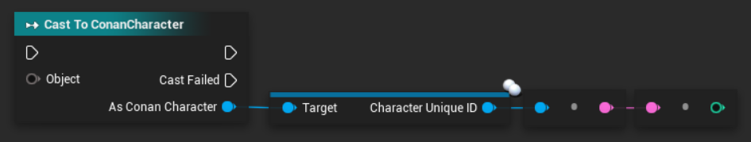

# Characters
A character object in Ratchet represents an online player.

## Members
Characters have only one variable member, which is `ID` - this is the same number as *Character Unique ID* in the DevKit (see the image below) and also as the database ID.

It is also used in Tot scripts as a backend variable to represent players.
Therefore you can freely convert this number to a player and a player to this ID in Tot scripts.

And in Ratchet plugins you can also use [getPlayerFromID](#getplayerfromid) to create a character object from this ID,
which is the only way to construct a character object without retrieving it from events or from functions like [getPlayersInRadius](#getplayersinradius).



## `getPlayerFromID` <Badge type="info" text="function" />
Create a character object from the player's database ID.

Syntax:
```lua
Character|nil getPlayerFromID( int id )
```

Example:
```lua
local player = getPlayerFromID(301)
print(type(player))
```

## `getPlayerFromName` <Badge type="info" text="function" />
Find a player by their character's real name (this will ignore `/act` names and similar).

Syntax:
```lua
Character|nil getPlayerFromName( string name )
```

Example:
```lua
local player = getPlayerFromName("Bob")
print(type(player))
```

## `getPlayersInRadius` <Badge type="info" text="function" />
Returns a table with all players in radius of specified number of **tiles** from a vector position.

Syntax:
```lua
table<Character> getPlayersInRadius( Vector position, float radius )
```

Example:
```lua
-- all players in radius of 10 tiles from the caster
local players = getPlayersInRadius(caster:GetPosition(), 10)
```

## `getAllPlayers` <Badge type="info" text="function" />
Returns a table of all players online on the server.

Syntax:
```lua
table<Character> getAllPlayers()
```

## `getPlayerCount` <Badge type="info" text="function" />
Returns a number of online players on the server.

Syntax:
```lua
int getPlayerCount()
```

## `GetName` <Badge type="info" text="function" />
Returns a display name of a character. This will use `/act` name if applicable.

Syntax:
```lua
string Character:GetName()
```

Example:
```lua
local name = player:GetName()
print(name)
```

## `GetRealName` <Badge type="info" text="function" />
Returns the actual character name as it exists in the database (ignoring `/act` and similar).

Syntax:
```lua
string Character:GetRealName()
```

Example:
```lua
local name = player:GetRealName()
print(name)
```

## `GetSteamID` <Badge type="info" text="function" />
Returns SteamID64 (decimal), it is just a long number, but it is saved as a string.

Syntax:
```lua
string Character:GetSteamID()
```

Example:
```lua
local steamId = player:GetSteamID()
print(steamId)
```

## `GetGuildID` <Badge type="info" text="function" />
Returns the database ID of a clan the player is a member of.

Syntax:
```lua
int Character:GetGuildID()
```

Example:
```lua
local guildId = player:GetGuildID()
print(guildId)
```

## `GetPosition` <Badge type="info" text="function" />
Returns a vector of the current coordinates of player's position in the game world.

Syntax:
```lua
Vector Character:GetPosition()
```

Example:
```lua
local position = player:GetPosition()
print(position.x, position.y, position.z)
```

## `GiveItem` <Badge type="info" text="function" />
Syntax:
```lua
bool Character:GiveItem( int itemId [, int quantity = 1 ] )
```

## `ExecuteConsoleCommand` <Badge type="info" text="function" />
Syntax:
```lua
void Character:ExecuteConsoleCommand( string command )
```