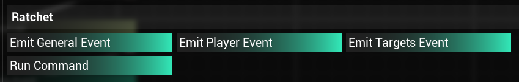
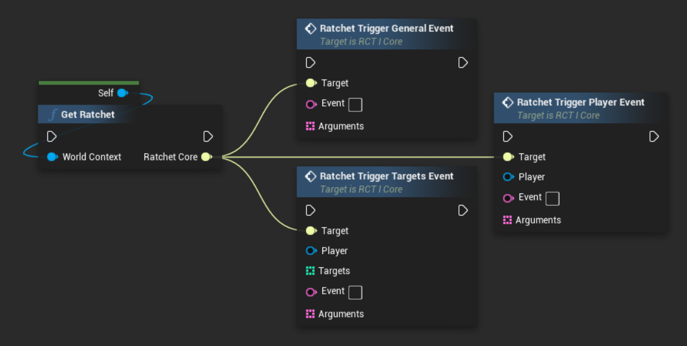
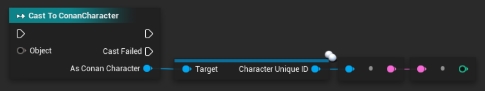
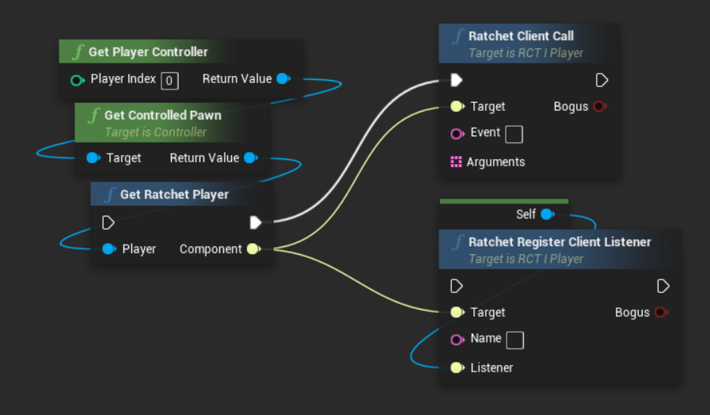

# Events
Events are one of the core mechanics of Ratchet. They're called when something happens on the server or when Workshop mods, Tot scripts, or other Lua plugins call them.

You can create your own events, however there are also some built into Ratchet that allow you to integrate your plugins with most common mods such as Roleplay Redux.

## Usage

### `on` <Badge type="info" text="function" />
Subscribes to an event. Callback function will be called every time event is triggered. Arguments will be passed into the function.

Syntax:
```lua
on( string event, function callback )
```

### `off` <Badge type="info" text="function" />
Unsubscribes from an event. Callback function has to be a variable reference that was used when subscribing, do not use anonymous functions.

Syntax:
```lua
off( string event, function callback )
```

### `once` <Badge type="info" text="function" />
Subscribes to an event but unsubscribes automatically once the event is triggered. This is useful to catch an event only once.

Syntax:
```lua
once( string event, function callback )
```

### `emit` <Badge type="info" text="function" />
Triggers an event. Any number of arguments can be provided - these will be passed into the callback function.
It might be good idea to use table for arguments if you want to be consistent with calls from Tot scripts and DevKit - see [Targets Event](#emit-targets-event) for more details.

Syntax:
```lua
emit( string event [, arguments... ] )
```

### `sendToClient` <Badge type="info" text="function" />
Sends data to client listener ([see DevKit implementation](#client-side)).

Syntax:
```lua
void sendToClient( string name [, table<string> arguments ] )
```

## Internal events

### `server_start` <Badge type="info" text="event" />
This event is triggered right after the server boots up and Ratchet loads all plugins.

There is no guarantee that all the mod controllers are spawned in yet unless Ratchet is on the bottom of the modlist order.
It is however guaranteed, that this happens *after* all plugins are loaded, which happens only after Ratchet's Workshop mod is loaded.

### `player_join` <Badge type="info" text="event" />
This event is triggered whenever a player connects to the server.

Character object should be fully initialized at the time of execution, but some functionality might still not work right away, especially if Ratchet is not on the bottom of the mod order.

Callback:
```lua
function( Character player )
```

### `player_quit` <Badge type="info" text="event" />
This event is triggered whenever a player disconnects from the server.

Because character object no longer exists at this point in time, only the database ID is sent to the callback function.
Do not try to get the Character object from ID, it won't work, as the player is already offline.

Callback:
```lua
function( int id )
```

## Roleplay Redux

### `RPR_useAbility` <Badge type="info" text="event" />
Whenever anyone uses any ability in RPR, this event is triggered.

This can be used for example to completely replace some RPR ability logic with Lua code.

Callback:
```lua
function( Character player, int ability, table targets )
```

Example:
```lua {1,9}
function useAbility(player, ability, targets)
    local targetNames = {}
    for _,target in ipairs(targets)do
        table.insert(targetNames, target:GetName())
    end

    print(player:GetName() .. " used ability #" .. ability .. " on " .. table.concat(targetNames, ", ") .. ".")
end
on("RPR_useAbility", useAbility)
```

### `RPR_updateRunes` <Badge type="info" text="event" />
Whenever anyone (un)equips any rune in RPR, this event is triggered.

Keep in mind, that due to nature of how inventory works in Conan Exiles, this event may be called much more often than needed.
Make sure to use conditions in your code to only run some additional code when you actually need to.

Callback:
```lua
function( Character character, table runes )
```

## Knight's Sanity

### `KS_midnight` <Badge type="info" text="event" />
This event is triggered whenever the in-game time reaches midnight.
Server has to be using KS time sync functionality for this to work.
There are no arguments being passed into a callback.

Example:
```lua {4}
function atMidnight()
    TotChat.Broadcast("It's midnight!")
end
on("KS_midnight", atMidnight)
```

## Tot ! Admin Scripts
Events can be called from Tot scripts using scripting nodes added by Ratchet mod.



The data are passed into an event callback function in order.

### Emit General Event
Inputs: Event, Arguments

```lua {1}
function callback(arguments)
    print("Event was called")
    for _,v in ipairs(arguments)do
        print(v)
    end
end
on("example_event", callback)
```

### Emit Player Event
Inputs: Event, Player, Arguments

```lua {1}
function callback(player, arguments)
    print(player:GetName() .. " called this event")
    print("Arguments: " .. table.concat(arguments, ", "))
end
on("example_event", callback)
```

### Emit Targets Event
Inputs: Event, Player, Targets, Arguments

```lua {1}
function callback(player, targets, arguments)
    print(player:GetName() .. " called this event")
    local targetNames = {}
    for _,target in ipairs(targets)do
        table.insert(targetNames, target:GetName())
    end
    print("Targets: " .. table.concat(targetNames, ", "))
    print("Arguments: " .. table.concat(arguments, ", "))
end
on("example_event", callback)
```

## Trigger from DevKit
Events can also be called from your own Workshop mods using Ratchet interface API.

### Server-side
Callback functions are the same as on the examples in previous section of this page.



::: info
If you are using the `Ratchet Trigger Targets Event` you have to use IDs for the `Targets` array.

You can retrieve it like this:

:::

### Client-side
Are you working with custom UI widgets and don't want to mess with RPCs? You can call events from client-side as well using the `Ratchet Client Call` function from `RCT_I_Player` interface (which is implemented on an actor component of every player).



You can also implement `RCT_I_ClientListener` on your blueprint and register this client listener to easily receive a response from Ratchet plugins straight into your UI.

To send data to this listener, use the [sendToClient](#sendtoclient) function.

::: info
Keep in mind that there can only be one instance of a client listener with the same name at a time. Registering a new one with the same name will overwrite the previous. This is intended behavior.
:::