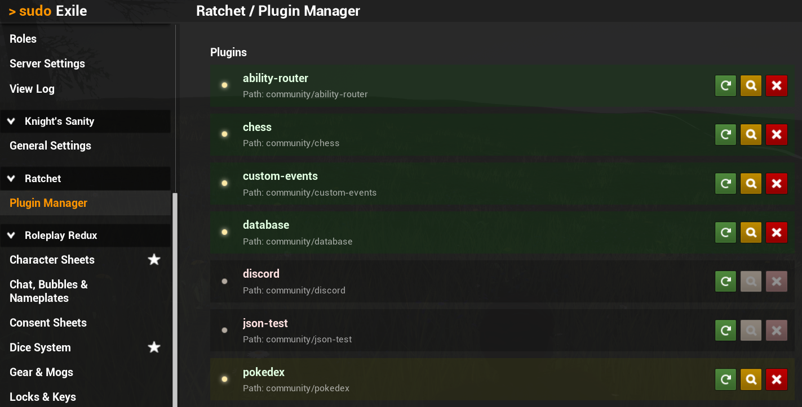

# Plugin Manager 🧩

You can start, stop and reload plugins from the Sudo admin panel.
Ratchet Plugin Manager section is available for those with Ratchet admin permission.
From this panel, you can also toggle [Hot Reload](/hot-reload) feature on individual plugins.

## Chat Commands
Plugins can also be managed using the `/ratchet` chat command.

Try it for yourself to see a list of commands.

